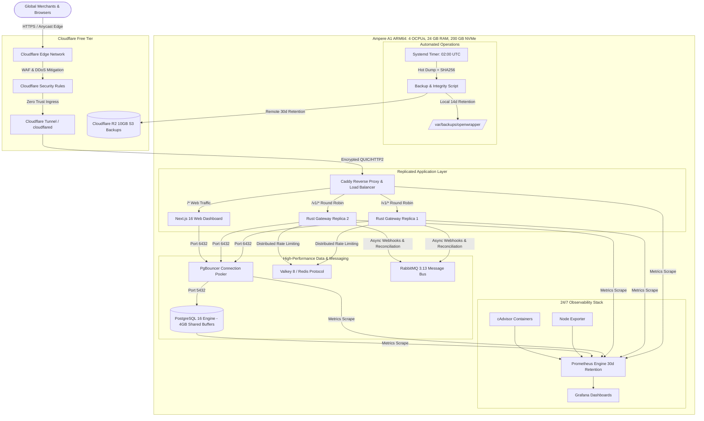

# OpenWrapper: Oracle Cloud Always Free & Cloudflare HA Architecture

This guide details the complete production architecture, provisioning, deployment, and operational runbooks for running **OpenWrapper** permanently at **$0.00/month** using Oracle Cloud Always Free Tier combined with Cloudflare Free Services.

---

## 1. High-Level Architecture



---

## 2. Lifetime Free Resource Allocation

| Resource Component | Provider & Tier | Allocation | OpenWrapper Stack Footprint | Free Margin Remaining |
|---|---|---|---|---|
| **Compute CPU** | Oracle Cloud Ampere A1 | 4 OCPUs (ARM64) | ~1.5 - 2.0 OCPUs peak | ~2.0 OCPUs headroom |
| **Compute Memory** | Oracle Cloud Ampere A1 | 24 GB LPDDR4 | ~10.5 GB stack memory | **~13.5 GB for OS & NVMe page cache** |
| **NVMe Block Volume** | Oracle Cloud Always Free | 200 GB NVMe | ~25 GB (OS + DB + 30d Metrics + 14d Backups) | **> 170 GB free** |
| **Egress Bandwidth** | Oracle Cloud Always Free | 10 TB / month | Estimated < 100 GB / month | **9.9 TB / month buffer** |
| **Edge Security & SSL** | Cloudflare Free | Unlimited | Automated edge TLS & DDoS mitigation | Included ($0.00) |
| **Zero Trust Ingress** | Cloudflare Tunnel | Unlimited | Zero open VPS inbound ports | Included ($0.00) |
| **Off-Site Backups** | Cloudflare R2 | 10 GB Storage / mo | ~2 - 4 GB encrypted backups | **> 6 GB free storage** |

### Memory Budget Breakdown (24 GB Host)

```
┌──────────────────────────────────────────────────────────────┐
│ Host RAM: 24,576 MB (24 GB)                                   │
├────────────────────────┬─────────────────────────────────────┤
│ PostgreSQL 16 Engine   │  5,500 MB (4GB buffers + work_mem)  │
│ RabbitMQ 3.13 Bus      │  1,536 MB                           │
│ Valkey 8 Cache         │  1,024 MB (allkeys-lru limit)       │
│ Prometheus TSDB (30d)  │    768 MB                           │
│ Next.js Web Dashboard  │    512 MB                           │
│ Rust Gateway Replica 1 │    384 MB                           │
│ Rust Gateway Replica 2 │    384 MB                           │
│ Grafana OSS            │    384 MB                           │
│ cAdvisor & Node Exp    │    192 MB                           │
│ Caddy & PgBouncer      │    192 MB                           │
│ Cloudflared Tunnel     │    128 MB                           │
├────────────────────────┴─────────────────────────────────────┤
│ Total Stack Footprint  : ~10,800 MB (~10.5 GB)               │
│ Free for Linux Kernel & NVMe Cache: ~13,776 MB (~13.5 GB)    │
└──────────────────────────────────────────────────────────────┘
```

---

## 3. Step-by-Step Provisioning Guide

### Step 1: Create Oracle Cloud Ampere A1 Instance
1. In Oracle Cloud Console, navigate to **Compute > Instances > Create Instance**.
2. **Image**: Select **Ubuntu 22.04 LTS** or **Oracle Linux 8/9** (ARM64 / aarch64).
3. **Shape**: Select **Ampere (VM.Standard.A1.Flex)**.
   - OCPUs: **4**
   - Memory: **24 GB**
4. **Boot Volume**: Specify **200 GB**.
5. **SSH Keys**: Upload your public SSH key.
6. **VCN & Subnet**: Default public subnet is fine (Cloudflare Tunnel does not require inbound open ports, so no security list inbound port modifications are necessary).

### Step 2: Configure Cloudflare Zero Trust Tunnel
1. Log in to [Cloudflare One / Zero Trust Dashboard](https://one.dash.cloudflare.com/).
2. Navigate to **Networks > Tunnels > Create a tunnel**.
3. Choose **Cloudflared**, name it `openwrapper-prod`.
4. Copy the tunnel token (looks like `eyJhIjoi...`).
5. Under **Public Hostnames**, create the following mappings:
   - `openwrapper.muejam.com` -> `HTTP://caddy:80` (Web Dashboard)
   - `gateway.openwrapper.muejam.com` -> `HTTP://caddy:80` (Rust Gateway API)
   - `grafana.openwrapper.muejam.com` -> `HTTP://grafana:3000` (Telemetry)

### Step 3: Create Cloudflare R2 Backup Bucket (Optional, Recommended)
1. In Cloudflare Dashboard, go to **R2 Object Storage > Create Bucket**.
2. Name the bucket `openwrapper-backups`.
3. Under **Manage R2 API Tokens**, create a token with **Object Read & Write** permissions.
4. Note `Account ID`, `Access Key ID`, and `Secret Access Key`.

---

## 4. Host Bootstrap & Stack Deployment

### 1. Connect to your VPS and clone the repository
```bash
ssh ubuntu@<YOUR_ORACLE_IP>
sudo git clone https://github.com/MoustafaAt1a/openwrapper.git /opt/openwrapper
cd /opt/openwrapper
```

### 2. Run Host Optimization Script
Run the automated host tuning script to install Docker ARM64, allocate 4GB swap, apply Google BBR congestion control, and optimize sysctl:
```bash
sudo bash infra/scripts/setup-host.sh
```

### 3. Configure Environment Variables
```bash
cd /opt/openwrapper/infra
cp .env.oracle.example .env
nano .env
```
Fill in the credentials:
- `CLOUDFLARE_DOMAIN=yourdomain.com`
- `CLOUDFLARE_TUNNEL_TOKEN=eyJhIjoi...`
- `POSTGRES_PASSWORD=<strong_random_password>`
- `BETTER_AUTH_SECRET=<openssl rand -base64 32>`
- `OPENWRAPPER_API_KEYS=<your_secure_api_key>`
- `GRAFANA_ADMIN_PASSWORD=<secure_grafana_password>`
- `R2_*` credentials (for S3 off-site backups)

### 4. Deploy the Zero-Downtime Stack
```bash
bash infra/scripts/deploy.sh
```

### 5. Enable Systemd Auto-Healing & Daily Backup Timer
```bash
# Enable stack to start automatically on VPS boot
sudo cp /opt/openwrapper/infra/systemd/openwrapper.service /etc/systemd/system/
sudo systemctl daemon-reload
sudo systemctl enable openwrapper.service

# Enable daily 02:00 UTC backups
sudo cp /opt/openwrapper/infra/systemd/openwrapper-backup.* /etc/systemd/system/
sudo systemctl daemon-reload
sudo systemctl enable --now openwrapper-backup.timer
```

---

## 5. Operational Runbooks

### Runbook 1: Health & Telemetry Verification
To get an instant terminal health check across all 12 services and host headroom:
```bash
bash infra/scripts/healthcheck.sh
```

Access your live Grafana Telemetry Dashboard:
- URL: `https://grafana.yourdomain.com`
- Credentials: User `admin`, Password as set in `.env`.
- Dashboards > OpenWrapper > **OpenWrapper Production Overview** displays:
  - Host CPU, 24GB RAM utilization, NVMe disk free space
  - Caddy request rate, HTTP status breakdown, P50/P95/P99 latency
  - Microservice container CPU & RAM consumption (cAdvisor)
  - NVMe disk I/O and free network bandwidth tracker

### Runbook 2: Manual Backup & Off-Site Sync Test
```bash
bash infra/scripts/backup.sh
```
This produces a verified, gzipped logical dump in `/var/backups/openwrapper/`, creates a `.sha256` integrity hash, and synchronizes the archive to Cloudflare R2.

### Runbook 3: Disaster Recovery Restore
To restore from the latest backup:
```bash
bash infra/scripts/restore.sh
```
Or specify an exact archive:
```bash
bash infra/scripts/restore.sh /var/backups/openwrapper/openwrapper_postgres_20260904_120000.sql.gz
```
The script validates SHA256 and archive integrity before safely restoring tables into PostgreSQL.

### Runbook 4: Rolling Code Upgrades (Zero Downtime)
When deploying a new commit from Git:
```bash
cd /opt/openwrapper
git pull origin main
bash infra/scripts/deploy.sh
```
`deploy.sh` rebuilds changed containers, performs a healthcheck-guarded rolling upgrade between `gateway-1` and `gateway-2`, ensuring that ongoing merchant requests and webhooks are never dropped.
